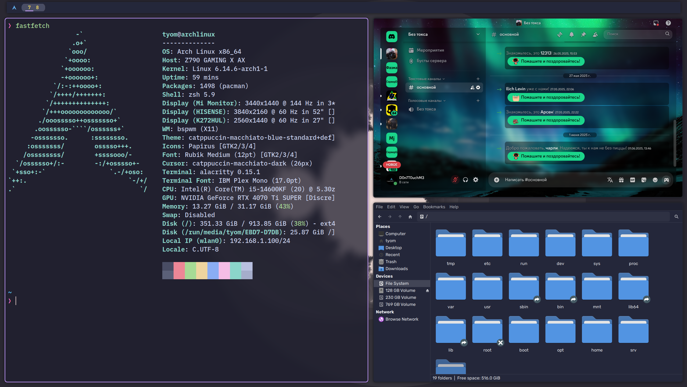
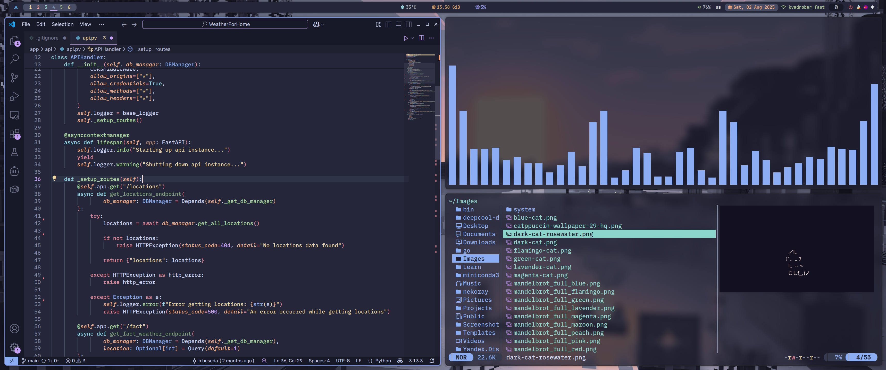

# ArchBSPWM - Минималистичная сборка на BSPWM 🐧




Персонализированная сборка Arch Linux с использованием тайлового оконного менеджера BSPWM. Легковесная, быстрая и эстетичная конфигурация.

## ✨ Особенности

- **Окружение**: 
  - BSPWM (тайловый оконный менеджер)
  - Polybar (кастомная панель)
  - Picom (композитор с эффектами)
  
- **Внешний вид**:
  - Тема: catppuccin-macchiato
  - Иконки: Papirus [GTK2/3/4]
  - Шрифты: Rubik Medium, IBM Plex Mono

- **Дополнительно**:
  - 🚀 Rofi (меню запуска)
  - 🔔 Dunst (уведомления)
  - ⌨️ sxhkd (горячие клавиши)

## 📦 Установка

**Требования**: Установленный Arch Linux (или производные)

1. Клонировать репозиторий:
```bash
git clone https://github.com/D0n7T0uchM3/arch-bspwm.git
cd arch-bspwm
```

2. Запустить файл инициализации билда
```
python3 system-configurator/main.py
```
